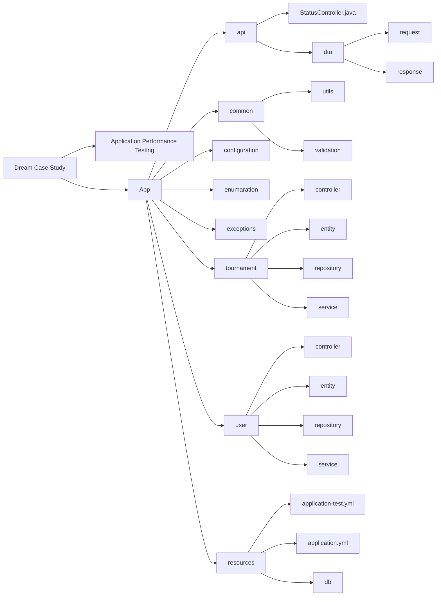
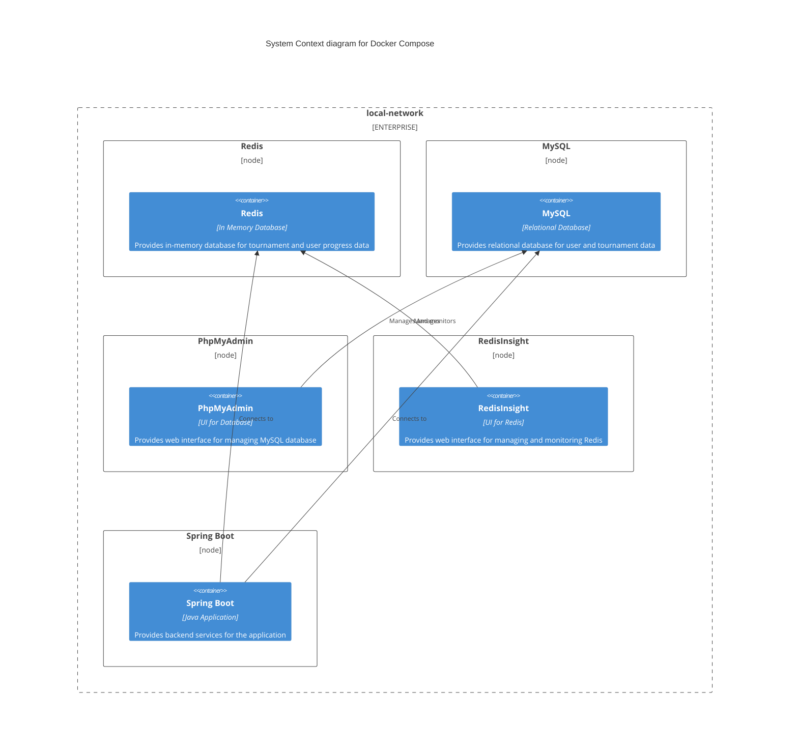
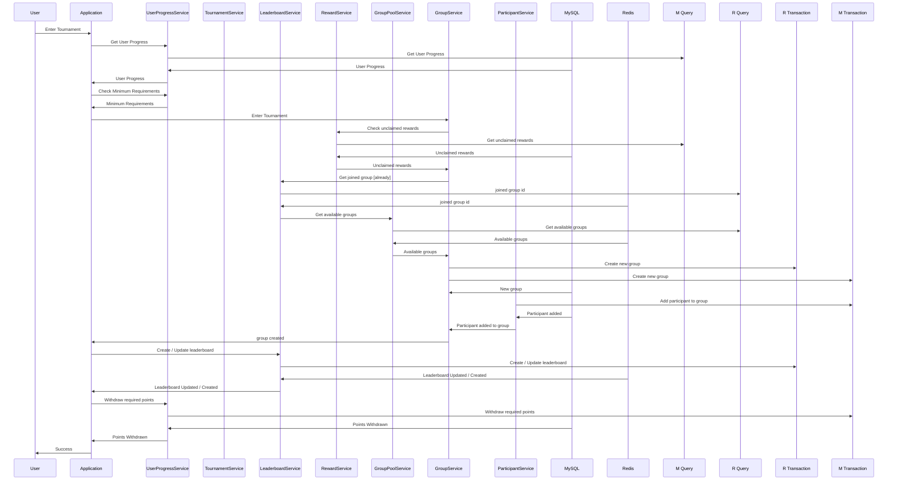
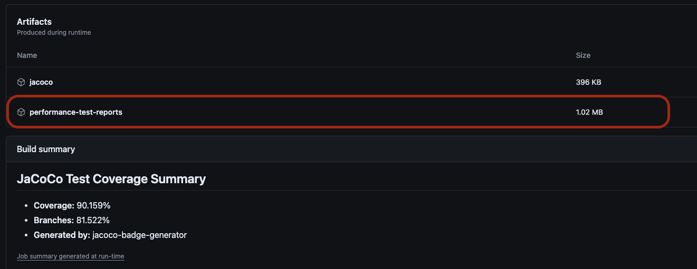
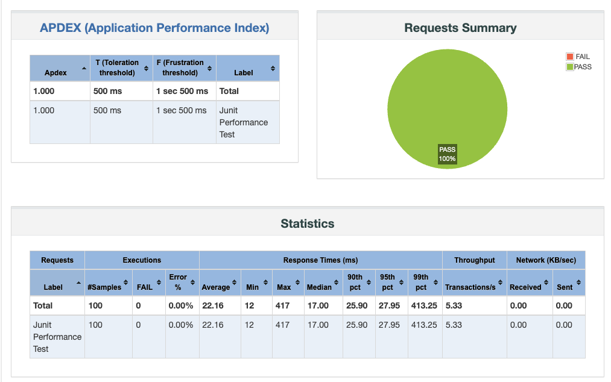

# Backend Engineering Case Study


### Introduction

This project is a simple backend application that is created for the Dream Case Study.

### Redis Methodology

With redis methodology, microservice is capable of holding high throughput and decreased latency on
related features

#### Realtime Group Pool Mechanism

With in the live tournament, we hold hot group details (empty slots, group id, group name, etc.)
in redis. When a user wants to join a tournament, we can easily find the available group with the
user's
country. With this way, we can decrease the latency of the system.

#### Live Ranking Mechanism.

With the live ranking mechanism, we can easily find the user's ranking in the leaderboard with
respect to the user's country and group.

#### Fast Updated Level Details with Redis.

With the updated level details, application updates the user's level details in the redis. With this
way, we can easily re rank the leaderboard of countries and related group with respect to the user's
current score.

#### Note that

All tournament related data is stored in the MySQL database. Redis is used for the live data that.
After / with the tournament, application updates the MySQL database with the final results.
After tournament, application clears the redis data for the next tournament.

### How to run the application

To run the application, you need to have docker and docker-compose installed on your machine.
You can Install them via the following links:

- [Docker](https://docs.docker.com/get-docker/)
- [Docker Compose](https://docs.docker.com/compose/install/)

After installing docker and docker-compose, you can run the following command to start the
application

```shell
cd deployment && docker-compose up -d
```

### Diagrams

#### Project Organization Diagram



#### Docker Compose Diagram



#### Sequence Diagram for Enter Tournament



### Postman Collection

You can find the postman collection [here](postman/dream_case_study.postman_collection.json).

### Performance Testing

On each commit, the application is tested with the performance tests. You can find the performance
test workflow [here](.github/workflows/build.yaml).
After each performance test workflow run, it generates simplified overviews of the performance tests
as tables:

#### UpdateLevelUser

| transaction            | sampleCount | errorCount | errorPct | meanResTime       | medianResTime | minResTime | maxResTime | pct1ResTime       | pct2ResTime        | pct3ResTime | throughput        | receivedKBytesPerSec | sentKBytesPerSec |
|------------------------|-------------|------------|----------|-------------------|---------------|------------|------------|-------------------|--------------------|-------------|-------------------|----------------------|------------------|
| Update level of a user | 400         | 0          | 0.0      | 54.60500000000003 | 38.0          | 5.0        | 312.0      | 79.90000000000003 | 301.49999999999807 | 311.99      | 306.5134099616858 | 0.0                  | 0.0              |
| Total                  | 400         | 0          | 0.0      | 54.60500000000003 | 38.0          | 5.0        | 312.0      | 79.90000000000003 | 301.49999999999807 | 311.99      | 306.5134099616858 | 0.0                  | 0.0              |

#### CreateNewUser

| transaction       | sampleCount | errorCount | errorPct | meanResTime       | medianResTime | minResTime | maxResTime | pct1ResTime       | pct2ResTime       | pct3ResTime | throughput        | receivedKBytesPerSec | sentKBytesPerSec |
|-------------------|-------------|------------|----------|-------------------|---------------|------------|------------|-------------------|-------------------|-------------|-------------------|----------------------|------------------|
| Total             | 400         | 0          | 0.0      | 77.23250000000004 | 58.0          | 7.0        | 421.0      | 98.90000000000003 | 393.2499999999971 | 420.0       | 228.8329519450801 | 0.0                  | 0.0              |
| Create a new user | 400         | 0          | 0.0      | 77.23250000000004 | 58.0          | 7.0        | 421.0      | 98.90000000000003 | 393.2499999999971 | 420.0       | 228.8329519450801 | 0.0                  | 0.0              |

Also it generates a detailed report for the performance test. You can find the detailed report from
the artifacts
section of the workflow.



#### Detailed Report



#### configuration.json

In this file, I aimed to configure some basic jmeter parameters easily. Also, you can add a new test
by adding a new json object to the configuration.json file. You can find the related
file [here](app-performance-test/src/test/jmeter/configuration.json)

```json
[
  {
    "testName": "CreateNewUser",
    "testDescription": "Create a new user",
    "className": "com.dreamgames.backendengineeringcasestudy.PerformanceTest",
    "methodName": "createUserTest",
    "threadCount": 20,
    "loopCount": 20,
    "duration": 20
  },
  {
    "testName": "UpdateLevelUser",
    "testDescription": "Update level of a user",
    "className": "com.dreamgames.backendengineeringcasestudy.PerformanceTest",
    "methodName": "updateLevelTest",
    "threadCount": 20,
    "loopCount": 20,
    "duration": 20
  }
]
```

#### How to run the performance tests Locally

In case you want to run the performance tests locally, you can use the following command:

```shell
  cd deployment/performance-test
  docker compose up -d --build --force-recreate
```

It will create a simple non-gui docker environment for the performance tests. You can find the
related
docker-compose file [here](deployment/performance-test/docker-compose.yml). After the environment is
up
It will check the application with trying rest api calls over /status endpoint. You can find the
related
script [here](scripts/jmeter_run.py).

If you have already up and running docker environment. And, dont want to wait docker build stages.
Still, you can use jmeter_run.py script to run the performance tests. With parameterized
methodology:

If the running environment is local:

- defines user variables for the jmeter test
- builds the project with maven
- moves required jar files and configures with configuration.json file
- runs the jmeter tests with the given parameters
- creates a detailed report

```shell
  cd scripts
  python3 jmeter_run.py
```

If the running environment is github actions:

- fetches user variables
- configures the jmeter tests with the given parameters
- runs the jmeter tests with the given parameters
- creates a detailed report and saves it as proper artifact

### TODO

- [x] Create a simple spring boot application that creates table in the database
- [X] Add custom exception handling
    - [X] Add custom exception handling for the application
    - [X] Refactor error responses for the application
- [X] Create more complex structure for the application
- [X] Write unit tests for the functions in `src/` directory
- [X] Write github workflow to run the tests
    - [X] Add mvn unit tests to the github workflow
    - [X] Add code coverage to the github workflow
    - [X] Add performance tests to the github workflow
- [ ] Optimize dockerfile for the application
- [X] Write documentation for the project
    - [X] Write README.md for the project
        - [X] Add brief explanation of how you organized your implementation and the choices you
          made in terms of
          design while solving problems.
        - [X] Add plantuml diagrams for the project
        - [X] Add how to run the application
    - [X] Write javadoc for the functions in the project
- [X] Optimize the code for better performance
    - [X] Update Level Up request with redis that we can store updated live data without waiting too
      much time.
    - [X] Add live leaderboard with respect to given scorings. (Consider by Country and Group)

#### Notes

I did not focus on the security of the application. Because it was not mentioned in the case study.
However, I also asked for the security requirements of the application via email. Yet, I did not get
any response. So, I did not focus on the security of the application.

What I can add for the security of the application:

- [ ] Add SSO Service to the docker environment
- [ ] Enable Spring Security for the application
- [ ] Add Security Layers with Spring 3.0
- [ ] Implement an JWT Decoder & User Details Service for the application
- [ ] Cors Configuration for the application
- [ ] Add CSRF Protection for the application
- [ ] Add JWT Auth Converter for the application