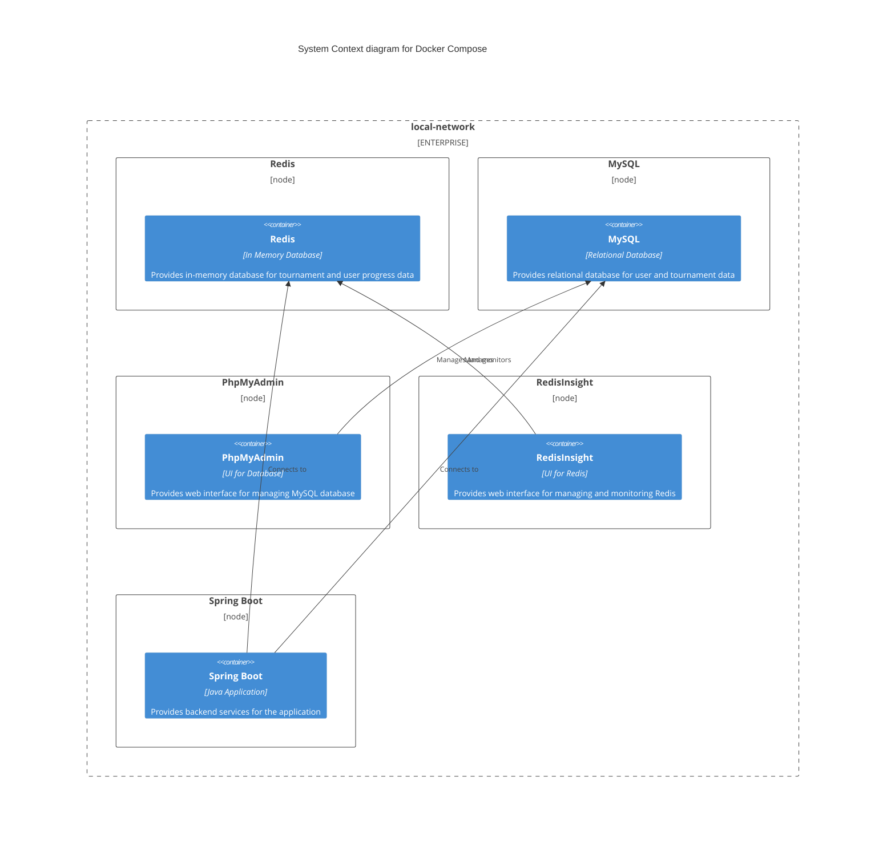
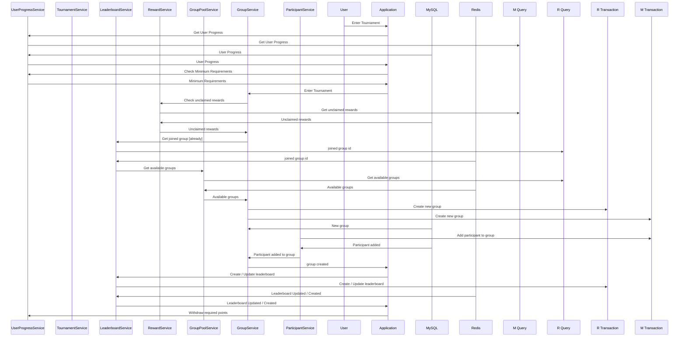

# Backend Engineering Case Study


Add brief explanation of how you organized your implementation and the choices you made in terms of
design while solving problems

### Redis Methodology

With redis methodology, microservice is capable of holding high throughput and decreased latency on
related features

#### Hot Waiting Room for New Tournament Groups

#### Live Ranking Mechanism.

#### Updated Level Details with Redis.

### How to run the application
To run the application, you need to have docker and docker-compose installed on your machine.
You can Install them via the following links:
- [Docker](https://docs.docker.com/get-docker/)
- [Docker Compose](https://docs.docker.com/compose/install/)

After installing docker and docker-compose, you can run the following command to start the application
```shell
cd deployment && docker-compose up -d
```

### Diagrams

#### Docker Compose Diagram


#### Sequence Diagram for Enter Tournament


### TODO

- [x] Create a simple spring boot application that creates table in the database
- [ ] Add custom exception handling
    - [X] Add custom exception handling for the application
    - [ ] Refactor error responses for the application
- [X] Create more complex structure for the application
- [X] Write unit tests for the functions in `src/` directory
- [ ] Write github workflow to run the tests
    - [X] Add mvn unit tests to the github workflow
    - [X] Add code coverage to the github workflow
    - [ ] Add performance tests to the github workflow
- [ ] Optimize dockerfile for the application
- [ ] Write documentation for the project
    - [ ] Write README.md for the project
        - [ ] Add brief explanation of how you organized your implementation and the choices you
          made in terms of
          design while solving problems.
        - [X] Add plantuml diagrams for the project
        - [X] Add how to run the application
    - [ ] Write javadoc for the functions in the project
- [ ] Optimize the code for better performance
    - [X] Update Level Up request with redis that we can store updated live data without waiting too
      much time.
    - [X] Add live leaderboard with respect to given scorings. (Consider by Country and Group)
    - [ ] Add a queue for processing the requests